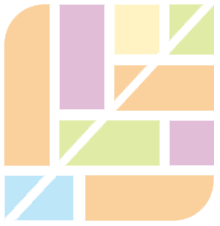

<p align="center">
    
</p>

<h1 align="center">WaterFull</h1>
<p align="center">
  <a href="https://github.com/MopTym/vue-waterfall">Vue2</a>
  &nbsp;
  ·
  &nbsp;
  <a href="https://github.com/Found-404/Vue3_WaterfallLayout">Vue3</a>
  &nbsp;
  ·
  &nbsp;
  <a href="https://github.com/Found-404/React_WaterfallLayout/tree/main?tab=readme-ov-file">React</a>
</p>

# React-waterfall

A waterfall layout component for React.js .

The address of the waterfall component of vue2 version is [vue-waterfall](https://github.com/MopTym/vue-waterfall).

This project is the waterfall layout of react version.

## Effect Preview

- [React-Waterfall](https://found-404.github.io/React_WaterfallLayout/)

## Installation

```shell
npm install --save waterfall-React
```

```html
<script src="https://cdn.jsdelivr.net/gh/Found-404/Vue3_WaterfallLayout@1.0.0/dist/Waterfall-React.umd.js"></script>
```

## Introduction

```js
import React, { useEffect, useState, useRef } from 'react'
import { Waterfall, WaterfallSlot } from "./index"
import ItemFactory from "./utils"

import "./index.css"


function Demo() {
    const [items, setItems] = useState(ItemFactory.get(100))
    const [loading, setLoading] = useState(false);
    const [line, setLine] = useState(true);
    const containerRef = useRef(null);
    // 添加项目
    // 加载更多数据
    const loadMore = () => {
        if (loading || items.length > 200) return;
        setLoading(true);
        setTimeout(() => {
            const newData = ItemFactory.get(10);
            setItems(prev => [...prev, ...newData]);
            setLoading(false);
        }, 500);
    };
    const switchLine = () => {
        setLine(!line)
    }
    const switchWidth = () => {
        setItems(items.map((e, index) => {
            return index === 0 ? {
                ...e,
                width: 300
            } : e
        }))
    }
    const Refresh = () => {
        const shuffled = JSON.parse(JSON.stringify(items));
        for (let i = shuffled.length - 1; i > 0; i--) {
            const j = Math.floor(Math.random() * (i + 1));
            [shuffled[i], shuffled[j]] = [shuffled[j], shuffled[i]];
        }
        setItems(shuffled);
    }


    // 检测是否滚动到底部
    function checkIfAtBottom() {
        const scrollTop = window.pageYOffset || document.documentElement.scrollTop;
        const scrollHeight = document.documentElement.scrollHeight;
        const clientHeight = window.innerHeight;
        return scrollTop + clientHeight >= scrollHeight;
    }
    // 滚动监听
    const handleScroll = () => {
        if (checkIfAtBottom()) {
            loadMore()
        }
    }
    useEffect(() => {
        window.addEventListener('scroll', handleScroll);
        return () => window.removeEventListener('scroll', handleScroll);
    }, []);
    return (
        <>
            <button onClick={switchLine}>switchLine</button>
            <button onClick={switchWidth}>switchWidth</button>
            <button onClick={Refresh}>Refresh</button>

            <Waterfall line={line ? 'h' : 'v'} lineGap={200} minLineGap={180} maxLineGap={220} >
                {
                    items.map((e, index) => <WaterfallSlot width={e.width} height={e.height} key={e.index} order={index} moveClass="item-move">
                        <div className="item" index={e.index} style={e.style} ></div>
                    </WaterfallSlot>)
                }
            </Waterfall>
            {loading ? <p>Loading</p> : ''}
        </>
    )
}

export default Demo

```

## Other versions

- [React-Waterfall](https://github.com/Found-404/React_WaterfallLayout)
- [Vue-Waterfall](https://github.com/Found-404/Vue3_WaterfallLayout)
